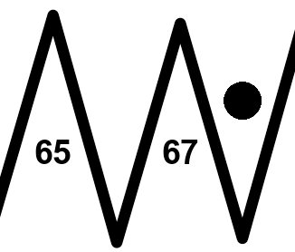
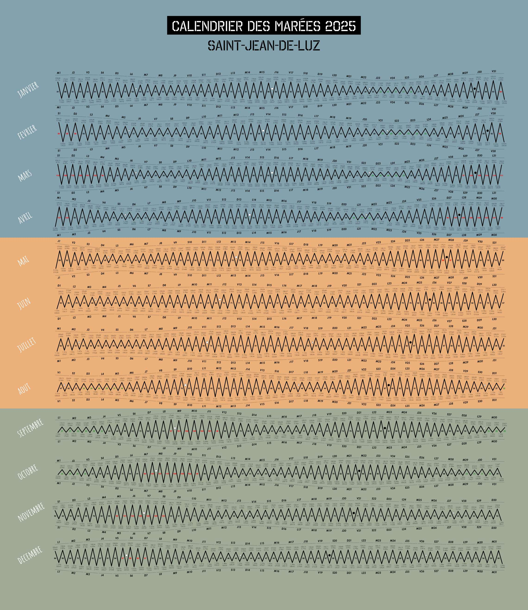
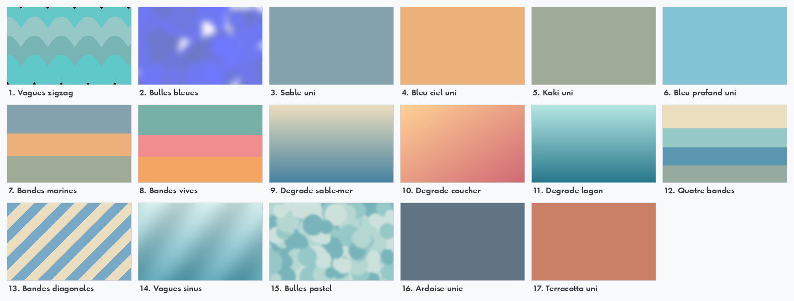

<div align="center">

<a href="https://github.com/Pataclop/beautiful-tides">
  
</a>

# 🌊 Beautiful Tides

**Génère de superbes affiches annuelles de calendriers de marées pour les ports français.**

Courbe de marée en vague, heures & coefficients, phases de la lune — le tout habillé
d'un fond au choix parmi **17 styles**.

[![Contributors][contributors-shield]][contributors-url]
[![Forks][forks-shield]][forks-url]
[![Stars][stars-shield]][stars-url]
[![Issues][issues-shield]][issues-url]


<br />



</div>

---

## ✨ Fonctionnalités

- 🗺️ **Carte interactive** — choisis ton port en cliquant sur la carte (OpenStreetMap en ligne, repli hors-ligne automatique).
- 🎨 **Galerie de fonds avec aperçu** — 17 fonds (dégradés, bandes, textures, aplats), sélection multiple pour tout générer d'un coup.
- 📅 **À la carte** — année, taille, sélection des mois, plusieurs ports en lot.
- 🗄️ **Aspiration des données** — remplis la base sans générer d'images ; récupère automatiquement tous les mois publiés jusqu'à l'horizon du site.
- ⚡ **Fluide & fiable** — génération en tâche de fond (aucun gel), progression, annulation, ouverture automatique du dossier de sortie.
- 🖼️ **Rendu stable** — moteur de rendu vérifié **au pixel près** par un test de non-régression.

## 🎨 Les 17 fonds

<div align="center">
  
</div>

## 🚀 Installation

```sh
pip install -r requirements.txt
# Uniquement pour télécharger de nouvelles données de marées :
playwright install chromium
```

## 📖 Utilisation

```sh
python interface.py
```

<table>
<tr><th>Onglet</th><th>Ce que tu peux faire</th></tr>
<tr>
  <td>🎨 <b>Générer</b></td>
  <td>Choisir le port (carte / liste / recherche ou « tous les ports »), un ou plusieurs fonds
  (Ctrl+clic), l'année, la taille et les mois — puis <b>Générer</b>. Les images arrivent dans
  <code>OUTPUT IMAGES/</code> (le dossier s'ouvre à la fin).</td>
</tr>
<tr>
  <td>🗄️ <b>Base de données</b></td>
  <td>Aspirer toutes les données à venir (sans générer d'images), pour un ou tous les ports,
  jusqu'à l'horizon publié par le site — avec progression et annulation.</td>
</tr>
<tr>
  <td>➕ <b>Ports</b></td>
  <td>Ajouter un port (nom + code meteoconsult) directement depuis l'interface.</td>
</tr>
</table>

### En ligne de commande

```sh
python scrap_all.py         # aspire tout le disponible, tous ports, jusqu'à l'horizon
python scrap_all.py 2026    # remplit une année précise (mois à venir)
```

> **Bon à savoir** — meteoconsult ne publie que les **mois à venir** (les mois passés et,
> en général, l'année suivante ne sont pas encore disponibles). L'application ne récupère
> donc que ce qui existe, en respectant la limite de fréquence du site.

## 🧩 Architecture

| Fichier | Rôle |
| --- | --- |
| `interface.py` | Interface graphique PyQt6 (onglets, carte, galerie, threads) |
| `fonctions.py` | Moteur de rendu (matplotlib / OpenCV) — sortie **identique au pixel près** |
| `backgrounds.py` | Registre des 17 fonds (rendu plein format + aperçus) |
| `db.py` | Base SQLite, parsing, récupération (sans dépendance au moteur de rendu) |
| `ports.py` + `data/ports.json` | Liste des ports (nom, code, coordonnées, côte) |
| `scrapper.py` / `scrap_all.py` | Scraping meteoconsult / aspiration de la base |
| `ui/` | Carte (Leaflet + hors-ligne) et galerie de fonds |
| `tests/pixel_baseline.py` | Non-régression pixel des fonds (`--capture` / `--check`) |

<details>
<summary><b>⚙️ Comment ça marche</b></summary>

<br />

Chaque mois est dessiné avec matplotlib (courbe de marée, heures, coefficients colorés selon
les seuils, phases de lune), les mois sont empilés, puis composés par transparence sur le fond
choisi. Les données proviennent de <code>marine.meteoconsult.fr</code> et sont mises en cache
dans une base SQLite locale, afin de générer une affiche même hors-ligne une fois les données
récupérées.

</details>

## 🤝 Contribuer

Les contributions sont les bienvenues ! Nouveaux ports (via l'onglet **Ports** ou
`data/ports.json`), nouveaux fonds (dans `backgrounds.py`), corrections… Ouvre une
[issue][issues-url] ou une pull request.

## 📄 Licence

Distribué sous licence **MIT**. Voir [`LICENSE`](LICENSE).

<!-- MARKDOWN LINKS & IMAGES -->
[contributors-shield]: https://img.shields.io/github/contributors/Pataclop/beautiful-tides.svg?style=flat-square
[contributors-url]: https://github.com/Pataclop/beautiful-tides/graphs/contributors
[forks-shield]: https://img.shields.io/github/forks/Pataclop/beautiful-tides.svg?style=flat-square
[forks-url]: https://github.com/Pataclop/beautiful-tides/network/members
[stars-shield]: https://img.shields.io/github/stars/Pataclop/beautiful-tides.svg?style=flat-square
[stars-url]: https://github.com/Pataclop/beautiful-tides/stargazers
[issues-shield]: https://img.shields.io/github/issues/Pataclop/beautiful-tides.svg?style=flat-square
[issues-url]: https://github.com/Pataclop/beautiful-tides/issues
